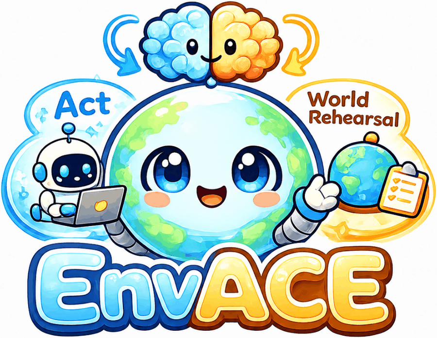
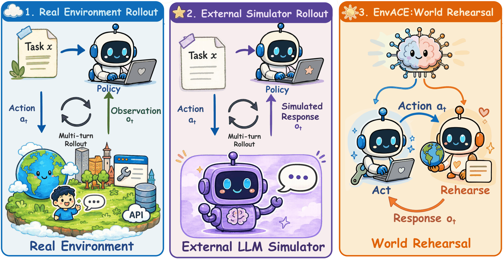

<p align="center">
  
</p>

<h1 align="center">EnvACE: Internalizing Environment Dynamics via World Rehearsal for Agentic RL</h1>

<p align="center">
  <a href="https://arxiv.org/abs/2608.06197">
    
  </a>
  <a href="https://within-yao.github.io/EnvACE/">
    
  </a>
  <a href="https://github.com/Within-yao/EnvACE">
    
  </a>
  <a href="https://huggingface.co/collections/Team-ACE/envace">
    
  </a>
  <a href="./LICENSE">
    
  </a>
</p>

`EnvACE` is an **agentic RL** framework that removes the external environment from the training loop. A single shared policy alternates between two roles:

- **Act** — generate the next tool call / environment-facing action, conditioned on the interaction history.
- **Rehearse** — play the role of the environment and generate the response induced by that action.

Subsequent decisions are conditioned on the policy's *own* rehearsed responses, so the trajectory unfolds without querying a real environment or a separate simulator. Both roles are trained jointly with a **role-wise GRPO** objective (separate baseline per role, shared parameters), so the policy internalizes environment dynamics as an implicit world model. At inference, that internalized world model enables **test-time scaling by private rehearsal**: run N imagined trajectories in parallel or sequentially, summarize them into a rehearsal memory, then use that memory to guide one committed execution in the real environment.

<p align="center">
  
</p>

<p align="center"><em>Real Environment · External Simulator · <b>EnvACE World Rehearsal</b></em></p>

## 🚀 News

- [2026-09-07] Model weights are released on Hugging Face: [EnvACE-Qwen3-8B](https://huggingface.co/Team-ACE/EnvACE-Qwen3-8B) and [EnvACE-Qwen3-1.7B](https://huggingface.co/Team-ACE/EnvACE-Qwen3-1.7B).
- [2026-08-07] We released the code and paper for EnvACE.

## Highlights

- **World-rehearsal training.** Environment response generation is a role of the acting policy, not a separate module.
- **Role-wise GRPO.** Per-role advantage baselines, shared policy parameters, jointly optimized end-to-end from task-success reward.
- **Test-time rehearsal.** Two modes — Parallel (independent attempts) and Sequential (each attempt sees prior rehearsals + revisions) — condensed into a rehearsal memory before a single external execution.
- **Reference results.** EnvACE-8B: **Overall 32.91** across BFCL-v4 / τ²-Bench / VitaBench; **TF1 46.78** on FinMCP-Bench — outperforming Simulator-8B, TOUCAN-7B, EnvScaler-8B, AWM-8B/14B, ScaleEnv-8B under the same open-source scale.

## Model Weights

| Model | Backbone | Params | Link |
|---|---|---|---|
| EnvACE-Qwen3-8B | [Qwen3-8B](https://huggingface.co/Qwen/Qwen3-8B) | 8.2B | [🤗 Team-ACE/EnvACE-Qwen3-8B](https://huggingface.co/Team-ACE/EnvACE-Qwen3-8B) |
| EnvACE-Qwen3-1.7B | [Qwen3-1.7B](https://huggingface.co/Qwen/Qwen3-1.7B) | 2.0B | [🤗 Team-ACE/EnvACE-Qwen3-1.7B](https://huggingface.co/Team-ACE/EnvACE-Qwen3-1.7B) |

Both checkpoints are the shared acting/rehearsal policy trained with role-wise GRPO. They use the
Qwen3 chat template and native function-calling format, so they drop into any standard Qwen3
tool-calling client:

```bash
vllm serve Team-ACE/EnvACE-Qwen3-8B --max-model-len 32768 \
    --enable-auto-tool-choice --tool-call-parser hermes
```

## Installation

```bash
conda create -n envace python==3.12 -y
conda activate envace

# EnvACE-specific pinned versions (torch 2.6.0 + cu124, sglang 0.4.6.post5,
# ray 2.49.2, transformers 4.53.2 — validated end-to-end).
pip install -r requirements_envace.txt
pip install flash-attn==2.7.4.post1 --no-build-isolation --no-cache-dir
pip install -e .
```

## Training

The script's defaults are the reference run — Qwen3-8B share, 2 × 8 GPUs:

```bash
JUDGE_HOST=<judge_ip> bash examples/drmas_trainer/run_checklist_share.sh
```

Everything else is a `${VAR:-default}` in the launcher, so you configure a run by exporting variables rather than editing the script. Read the header of [`run_checklist_share.sh`](examples/drmas_trainer/run_checklist_share.sh) first — it lists the four prerequisites the script assumes and documents each knob inline. Common overrides:

```bash
REFERENCE_MODEL_PATH=$PWD/models/Qwen/Qwen3-8B \
SIMULATOR_MODEL_PATH=$PWD/models/Qwen/Qwen3-8B   # backbone for both roles
trainer_nnodes=1 train_data_size=8               # single node, 8 GPUs
CALLER_MODE=frozen                               # train the Simulator only
bash examples/drmas_trainer/run_checklist_share.sh eval   # validation pass, no updates
```

## Citation

```bibtex
@article{envace2026,
  title  = {EnvACE: Internalizing Environment Dynamics via World Rehearsal for Agentic Reinforcement Learning},
  author = {Xu, Zishan and Yao, Zhiyuan and Chen, Yuxin and Guo, Yifu and Lu, Zhengxi and
            Lu, Yuquan and Huang, Jinyang and Xu, Yan and Wang, Yasheng and Zhang, Weinan and
            Zeng, Xingshan and Liu, Weiwen},
  journal = {arXiv preprint arXiv:2608.06197},
  year   = {2026}
}
```

## Acknowledgement

Code builds on [Dr. MAS](https://github.com/langfengQ/DrMAS) (multi-agent RL orchestration), [verl-agent](https://github.com/langfengQ/verl-agent), and [verl](https://github.com/volcengine/verl). The A3B judge is [Qwen3-30B-A3B](https://huggingface.co/Qwen/Qwen3-30B-A3B); the actor backbone is [Qwen3-8B](https://huggingface.co/Qwen/Qwen3-8B). Related environment-scaling baselines we compare against: Simulator, TOUCAN, EnvScaler, AWM, ScaleEnv (see the paper for citations).
